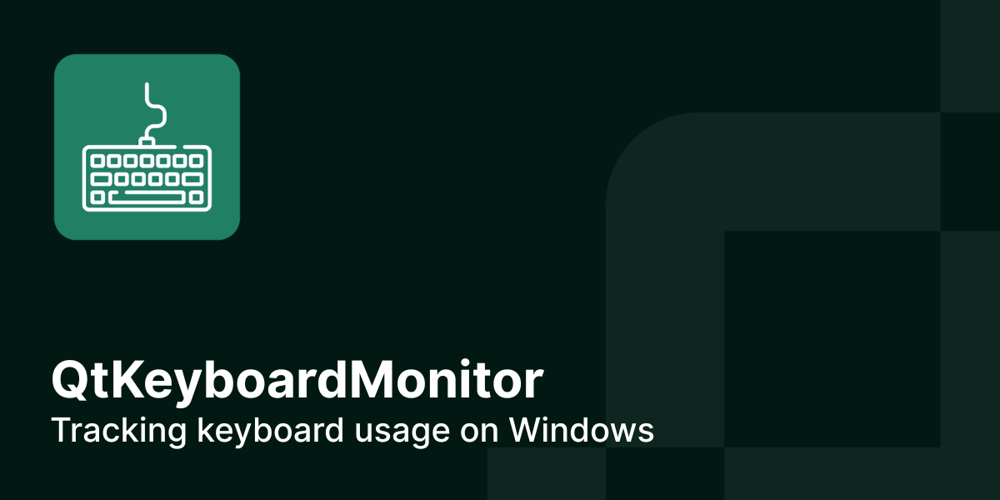

# QtKeyboardMonitor
App written with Qt to track keyboard usage on Windows.

It uses windows libraries to detrmine state of keyboard (and also mouse) buttons.
By using those libraries the keyboard state can also be tracked in the background.

---

---

User don't have to be focused on window for the tracking to take place - it can eaven be minimalized.
The keys state are checked every time the timer is triggered. Timer is triggered every 100ms.
User activity is measured with three variablem APS, APM and avarageAps.

- APS variable stands for Actions Per Second. It's number of buttons pressed by user every second. APS is updated every second.
- APM variable stands for Actions Per Minute. It's sum of the number of keys presses on the keyboard, per minute. As expected variable is updated every minute.
- AvarageAPS is just avarage number of actions per second. It is updated every minute. Avarage is counted simply by deviding current APM value by 60.

# How to use
To see the example simply clone this repository and simply run the project - no additional configuration is needed.

If you want to reuse this code in a QML app, simply create proper C++ class with code from KeyboardMonitor.cpp and KeyboardMonitor.h and then, add context to QML engine with this line:

`engine.rootContext()->setContextProperty("keyboardMonitor", keyboardMonitor);`

Now you can use keyboard monitor from the QML level. For examples how to use it, see main.qml file.

# Licence
This project is licensed under the MIT License - see the LICENSE.txt file for details.
 
 DISCLAIMER: Somco Software does not bear responsibility for inappropriate or malicious use of code in this project

## About Somco Software (previously Scythe Studio)
We’re a team of **Qt and C++ enthusiasts** dedicated to helping businesses build great cross-platform applications. As an official Qt Service Partner, we’ve earned the trust of companies across various industries by delivering high-quality, reliable solutions. With years of experience in **Qt and QML development**, we know how to turn ambitious ideas into outstanding products.

<table style="margin: 0 auto; border:0;">
    <tr style="border:0">
        <td style="border:0">
            
        </td>
        <td style="border:0">
            
        </td>
        <td style="border:0">
            
        </td>
        <td style="border:0">
            
        </td>
    </tr>
</table>

We offer a wide range of services—from brainstorming ideas to delivering polished applications—always tailored to our clients’ needs. By combining deep knowledge of Qt modules and modern technologies with a practical, cost-effective approach, we create solutions that truly make a difference.

# Professional Support
Need help with anything? We’ve got you covered. Our professional support services are here to assist you with. For more details about support options and pricing, just drop us a line at https://somcosoftware.com/en/contact.

# Follow us
Check out those links if you want to see Somco Software in action and follow the newest trends saying about Qt Qml development.

* 🌐 [Somco Software Website](https://somcosoftware.com/en/)
* ✍️  [Somco Software Blog Website](https://somcosoftware.com/en/blog)
* 👔 [Somco Software LinkedIn Profile](https://www.linkedin.com/company/scythestudio/mycompany/)
* 👔 [Somco Software Facebook Page](https://www.facebook.com/ScytheStudiio)
* 🎥 [Somco Software Youtube Channel](https://www.youtube.com/channel/UCf4OHosddUYcfmLuGU9e-SQ/featured)
